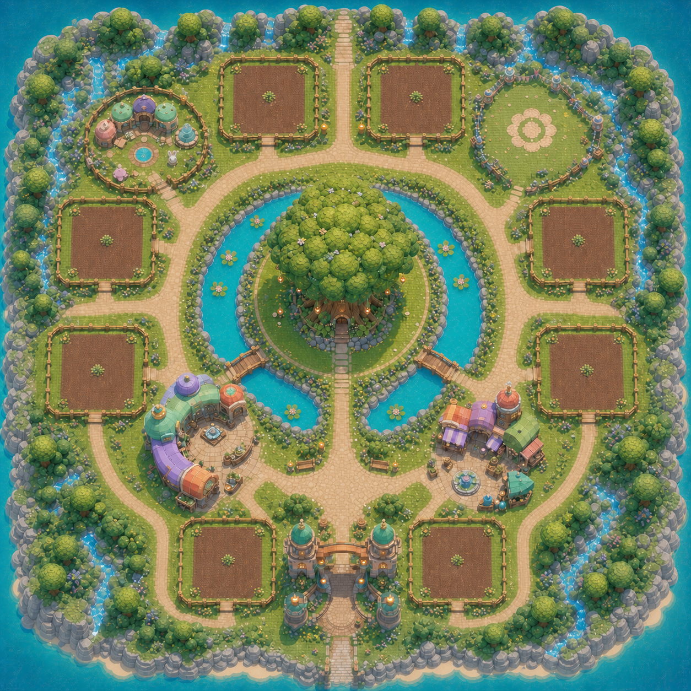
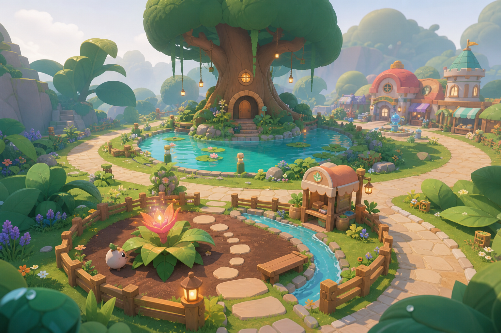
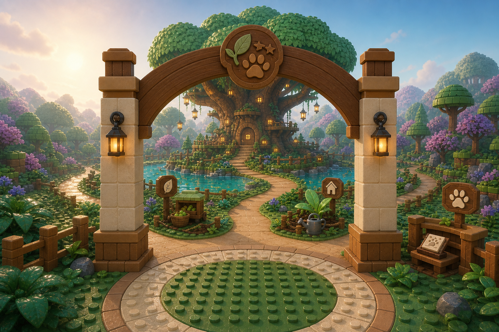
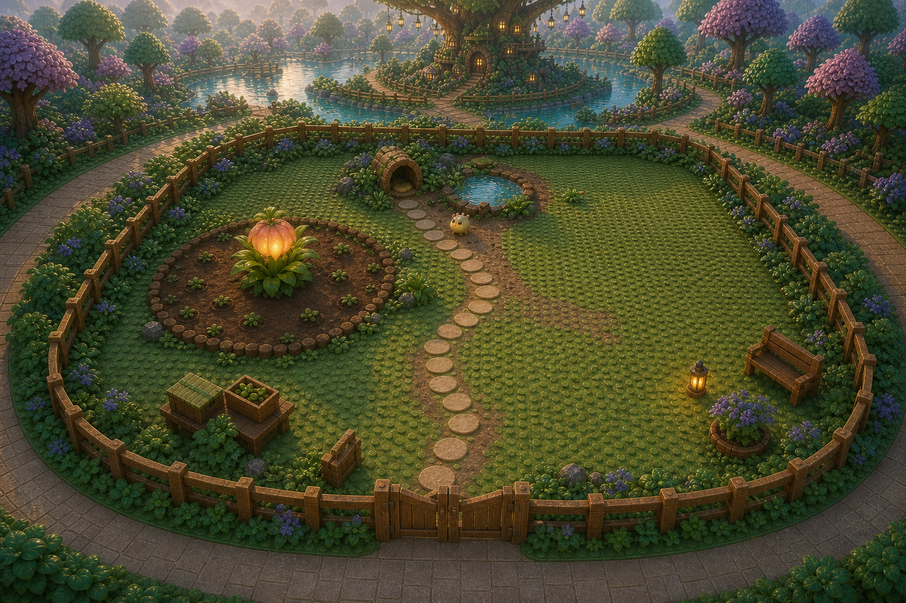
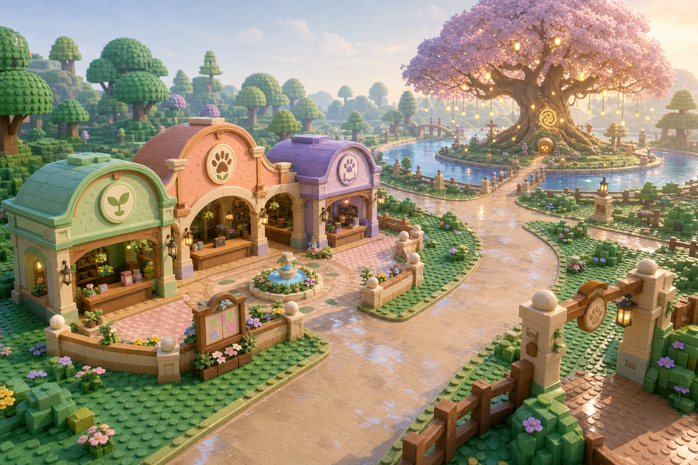

# Approved Concept Art

This folder preserves the user-approved visual direction for Catch a Creature as of 2026-07-17.

These images are **original visual references**, not Roblox or Blender production assets. They communicate mood, spatial relationships, scale intent, color, and material language. Every production model, texture, interface, effect, and audio asset will be created from scratch for this project.

## Evidence and truth status

- Approval evidence: Direct user approval in the project design session on 2026-07-17
- Confidence: High for visual direction; medium for exact spatial feasibility
- Truth label: Not yet implemented
- Required validation: Roblox Studio graybox, camera, navigation, crowding, and performance tests
- Scale warning: Perspective artwork is not a dimensioned construction drawing

## Approved references

### Whole-map top-down concept

Current planning assumptions shown in this image:

- The Welcome Gate is centered at the southern edge and aligned directly with the Memory Tree
- The Memory Tree and crescent pond form the central navigation anchor
- Eight equal player plots form the outer progression ring; each represents the approved 72×72-stud footprint
- A reserved future breeding footprint is northwest and a reserved future weather/event meadow is northeast; neither is initial-playable production scope
- The Caretaker Hub is southwest and the selling market is southeast
- The Caretaker Hub opens inward toward the tree and remains beside the main circulation route
- Shared facilities sit between the plot ring and central sanctuary without blocking the arrival axis
- The ocean, cliff, waterfall, and foliage perimeter is illustrative enclosure; the north path is the provisional expansion corridor

- Truth label: Not yet implemented
- Evidence: User-requested original concept render, visually inspected on 2026-07-17
- Planning assumptions: Eight-player server capacity, secondary-zone footprints, and the illustrated island perimeter
- Required validation: Dimensioned construction overlay and Roblox Studio graybox testing

### Crescent Pond Sanctuary overview

Approved direction:

- A compact sanctuary organized around a dominant Memory Tree and crescent-shaped water feature
- Curving paths, intimate visual rooms, and a cozy living-storybook atmosphere
- Quiet environmental geometry that lets creatures, plants, mutations, and plot customization become the spectacle
- Stud-forward Roblox-inspired terrain combined with smoother paths, water, soil, and props

This image is an atmosphere and relationship reference, not the final top-down layout.

### Welcome Gate and tutorial sightline

Approved direction:

- The Memory Tree is centered through the Welcome Gate on the player's first arrival
- The primary trail provides an immediate, unobstructed route toward the sanctuary center
- Simple icon-based trail markers introduce habitat flora, home/plot navigation, and creatures
- The gate remains visually important without competing with the Memory Tree

### Standard player plot

Approved requirements:

- Every player receives the same **72×72-stud outer plot footprint**
- Every plot receives the same buildable area and functional capacity
- Plots may rotate to face the sanctuary center, but may not change size
- The spacious footprint must support habitat flora, creatures, paths, decoration, and later breeding features without becoming unreadable
- Exact camera clearance, boundary thickness, and maximum-density navigation require Studio validation

The rounded presentation in the artwork is a styling reference; the numeric 72×72 rule controls implementation.

### Caretaker Hub orientation

Approved requirements:

- The Caretaker Hub sits southwest of the central pond and Memory Tree
- Its connected U-shaped courtyard, front arches, counters, and entrances open northeast toward the tree and pond
- The hub stays beside the main arrival trail instead of blocking it
- The Memory Tree appears ahead-right from the hub and remains the dominant landmark
- The mint nursery, peach lodge, and lavender journal archive read as one connected pavilion

## Superseded concepts

Earlier drafts with an off-center gate sightline, a smaller plot, or a Caretaker Hub facing away from the Memory Tree were intentionally excluded. They are not approved implementation references.

## Next required planning artifact

The next planning artifact should convert the top-down concept into a **dimensioned construction map**. It must resolve final player count, plot centers, 72×72 boundaries, path widths, pond and tree footprint, hub footprint, spawn, tutorial stops, selling area, breeding sanctuary, expansion reserves, and safe circulation before detailed construction begins.
